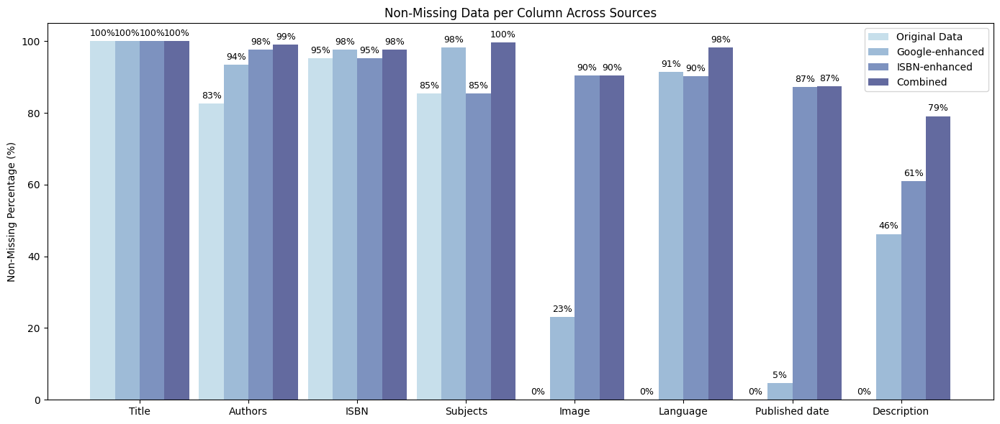

# Book Recommendation System: Final Report
A machine learning project by Amélie Madrona & Linne Verhoeven. <br>
For interactive learning on this project, check-out our video on Youtube: https://youtu.be/GcgB8V5QjHA?si=deK6RG9Pg3uF-wZ4

## Table of Contents  
[Introduction](#introduction)  
[Datasets Overview & EDA](#datasets-overview-and-eda)  
[Data Enhancing](#data-enhancing)  
  [Google Books API](#google-books-api)  
  [ISBN Database API](#isbn-database-api)  
  [Outcome of Data Enhancing](#outcome-of-data-enhancing)  
  [Data Enhancing Extension](#data-enhancing-extension)  
[Recommendation System Techniques](#recommendation-system-techniques)  
  [Collaborative Filtering (CF)](#1-collaborative-filtering-cf)  
    [User-Based CF](#user-based-cf)  
    [Item-Based CF](#item-based-cf)  
  [Content-Based Filtering (CBF)](#2-content-based-filtering-cbf)  
    [Embedding Techniques Used](#embedding-techniques-used)  
      [TF-IDF](#tf-idf-term-frequency-inverse-document-frequency)  
      [BERT Embeddings](#bert-embeddings)  
      [Google Gemini Embeddings](#google-gemini-embeddings)  
  [Hybrid Recommender System](#3-hybrid-recommender-system)  
[Evaluation Table](#evaluation-table)  
[Example Recommendations](#example-recommendations)  

## Introduction

This project aims to develop a recommender system that proposes books to users based on either their previous behavior (interaction history) or the characteristics of the books themselves. We explored three main approaches:

1. **Collaborative Filtering**: Based on user-item interaction patterns.
2. **Content-Based Filtering**: Based on item attributes like title, genre, and description.
3. **Hybrid Recommender**: A combination of both approaches.

We evaluated different models using metrics like **Precision@K** and **Recall@10** to measure the effectiveness of recommendations. 

Before we explain these different techniques, let's have an overview of the datasets that we were provided with. In the second section, we explain data enhancing techniques used to enrich the data at our availability. Then, we introduce the different methods we tried for our recommender system. Finally, we show example results of our recommender system.

## 📊 Datasets Overview and EDA [See: exploration.ipynb]

To get a feeling of the amount of data that we are working with, let's look at the total number of interactions, the number of unique items (or books) and the number of unique users.

<div align="center">

| Metric              | Count   |
|---------------------|--------:|
| Total interactions  | 87,047  |
| Unique items        | 15,291  |
| Unique users        | 7,838   |

</div>

We're dealing with a dataset of a reasonable size, while it still represents much more data than could be handled by hand for sure. Let's now look at the data we have for the interactions.


Another couple of key metrics:
* The average number of interactions between a user and books is 11
* The median number of interactions is 6

We see that the distribution of interactions is positively skewed, with users having up to 385 interactions with reading materials!

Let's now focus on the data we have for the items. The first thing to do was to perform a bit of data cleaning by:
* Extracting the first valid ISBN from the 'ISBN Valid' column.
* Cleaning the titles as they had a trailing '/', which also supports our data enhancing.
* Cleaning the authors from birth and death years to ensure a consistent data formatting.

The next step was to look at is how complete our dataset is, or how much missing data it has. 


We see that the only datapoints that we consistently have throughout all the items is the index (i) and the title, and publishers for almost all of them. Otherwise, roughly 5% of the ISBNs, 15% Authors and 17% of Subjects are missing.

There are also many other data points that we don't have: language, book description, publication date and perhaps information about the book covers. 

How could we possibly remedy this and enhance the data we have access to?

## Data enhancing 

We used APIs to extract more data about the items that are part of the library.

### Google Books API

The data enhancing for this step was composed of two parts. First, looking up books based on their first valid ISBN to extract the following missing entries:
* Book Description
* Publisher
* Subjects

As well as new data points:
* Google's Canonical Link, or the permanent link to the Google Books entry of the book. This will possibly useful for our UI later.
* Google's Image Link, or the permanent link to the book's cover. This will also possibly useful for our UI later.
* Language of the book, possibly useful for our embeddings later.
* Publication date of the book, possibly useful for our embeddings later.

Second, we also looked up books by their title to try to extract their ISBN as well as all the other datapoints mentioned above. In doing so, we enhance the potential entries we find using our second data enhancing method. 

### ISBN Database API

The same datapoints as above were extracted using the ISBN Database. We combined all these newly found datapoints in the following way: first priority for all the fields to the original dataframe, then Google API entries, then ISBN Database entries. An exception to that is for the Image Link, which turned out being fallacious for many entries. We therefore gave priority to the Image link provided by the ISBN Database. When running our models, we tried giving the opposite priority to the two enhanced database, which did not change results by much. However, we made the choice to keep the entries from the original dataset intact, considering that it is the ground truth.

### Outcome of data enhancing

The final results of our data enhancing techniques are shown in the figure here below. The light blue bar indicates the original dataset, the next two bars the results of the individual data enhancing techniques and the last bar indicating the resulting dataframe after the combination of both methods. We're able to achieve remarkable results across all dimensions, hitting almost 80% and above for all the data points. 



### Data enhancing extension

In addition to the previous enhancing methods, we used BERTopics to extract the topics for each document from our corpus. To do so, we used the title and the description of each book. First, the algorithm uses a pretrained BERT model to capture semantic meaning of the text down to its core. Then, we used the built-in UMAP dimensionality reduction function to cluster the topics into 25 topics. The results are as follow:


We see that the large majority of the topics are unidentified by the model. The most prominent topics seem to be feminism, psychology and academic research. We could have manually labelled the clusters to make them more human-friendly, but decided to keep them as such to not introduce bias. In fact, we used these topics for our recommender system by including the extracted keywords per topic in embeddings, as seen in the next section. The results were An interesting extension to our work would be to run cross validation to find the optimal number of topics for the embeddings.

### Recommendation system techniques [See: RecommenderSystem.py]
#### 1. Collaborative Filtering (CF)

Collaborative filtering makes recommendations by analyzing past user behavior (e.g., which books were read) and identifying similarities between users or items.

##### User-Based CF

- **Concept**: Recommend books liked by users who are similar to the target user.
- **Baseline similarity**: Cosine similarity  
  - Measures the angle between item vectors; suitable for sparse, implicit data.
- **K-Nearest Neighbors (KNN)**: With the goal of improving and evaluating the User-based collaborative filtering recommender system, we implemented a KNN-based variant using scikit-learn’s `NearestNeighbors`. Instead of relying on a full similarity matrix (which is rather computationally heavy and noisy), the knn approach identifies only the top-*k* most similar items for each prediction. We tested multiple *k* values (ranging from 10 to 100 neighbors) using *5* randomized train-test splits. For each configuration, we measured the mean *Precision@10*. We visualized the results with error bars to reflect performance variability across different random splits. We found optimal performance at k = 60.
[see CF_w.knn.ipynb]


- **Conclusion**: Cosine similarity consistently outperformed other metrics for item-item collaborative filtering in our implicit feedback setting.

##### Item-Based CF

- **Concept**: Recommend books similar to those a user already interacted with.
- **Baseline Similarity**: Cosine similarity  
  - Measures the angle between item vectors; suitable for sparse, implicit data.
- **K-Nearest Neighbors (KNN)**:
  - As in the User-Based CF case, we tested again different values for k (number of neighbors) and found optimal performance at*k = 70*.
- **Pearson Correlation**: Not used because it's more effective for **explicit ratings** (e.g., from 1–5). Pearson correlation adjusts for user bias.
- **Conclusion**: Cosine similarity consistently outperformed other metrics for item-item collaborative filtering in our implicit feedback setting ([in line with academic literature](https://link.springer.com/chapter/10.1007/978-981-10-7398-4_37)).

---

#### 2. Content-Based Filtering (CBF)

Content-based filtering recommends books that are similar in content to those the user liked previously. This method does not depend on what other users did.
To compare book content, we transformed textual metadata (title, author, description, etc.) into **embeddings**: numerical vector representations of the semantic meaning of a piece of text that allow us to compute similarity.

##### Embedding Techniques Used

###### TF-IDF (Term Frequency-Inverse Document Frequency)

- **What**: A classic method in information retrieval. Breaks down text into individual tokens and measures word importance relative to all other books.
- **How**: Represents text as sparse vectors based on word frequency, adjusted by how unique each word is.
- **Use Case**: Good for surface-level textual similarities (e.g., shared keywords).
- **Example**:  
  Book: *Harry Potter and the Philosopher's Stone*, Author: *J.K. Rowling*, Publisher: *Bloomsbury*  
  TF-IDF counts the frequency of each word, downweights common ones like “publishing,” and generates a sparse vector.

###### BERT Embeddings

- **What**: Deep learning model (transformer architecture) that takes full phrases or sentences.
- **How**: Generates dense, contextualized embeddings that understand semantic meaning.
- **Use Case**: Captures deeper relationships in content (e.g., plot similarities).
- **Example**:  
  Input: “Harry Potter and the Philosopher's Stone J.K. Rowling Bloomsbury”  
  BERT understands context and recognizes title, author, and organization even without exact matches.

###### Google Gemini Embeddings

- **What**: The `gemini-embedding-001` model from Google, accessed via API.
- **How**: Uses pretrained transformer models like BERT, but more advanced.
- **Use Case**: Leading semantic embedding model ([MTEB Leaderboard](https://huggingface.co/spaces/mteb/leaderboard)). Easy integration and efficient.

#### 3. Hybrid Recommender System [See: Hybrid_gridsearch.ipynb]

We combined both collaborative and content-based approaches using a **weighted sum** of different similarity matrices. We did this to leverage the strengths of each system while mitigating their individual weaknesses. Collaborative filtering captures patterns from user behavior but struggles with new or sparsely rated items, while content-based filtering can recommend new or niche items using item attributes but often lacks diversity. By blending them together, we ensure that recommendations remain accurate even when user interaction data is limited, while also introducing semantic richness and personalization based on content.

We explored a wide range of model combinations. At the similarity level (i.e., when computing item-to-item similarity), we experimented with hybrids of different sources: BERT × Google Embeddings × Item-based CF, TF-IDF × Google × CF, and a full combination of TF-IDF × BERT × Google × CF. In addition to combining similarities, we also tested hybridization at the prediction level. Here, we incorporated User-based Collaborative Filtering and ran a simplified grid search over weighted combinations of TF-IDF, BERT, Google Embeddings, Item-based CF, and User-based CF prediction matrices.

```python
hybrid_sim = a * tfidf_sim + b * item_cf_sim + c * google_sim + d * bert_sim
hybrid_pred = a * tfidf_prediction + b * item_cf_prediction + c * google_prediction + d * bert_prediction + e * user_cf_prediction
```

We did not perform full grid search or cross-validation due to computational limits, but used **simplified tuning** to demonstrate the concept.
The highest precision was found when combining similarities of BERT, TF-IDF, Google, and item-CF. This is the model our current recommender is running on:
hybrid_sim = 0.05 * tfidf_sim + 0.7 * item_cf_sim + 0.15 * google_sim + 0.1 * bert_sim

**Note**: Without cross-validation, results may overfit. However, the hybrid approach still showed the best overall performance in our simplified tests.

---

### Evaluation Table
## Model Performance Comparison

| Model                                 | Precision@10 | Recall@10 |
|--------------------------------------|--------------|-----------|
| User-User CF                         | 0.0612       | 0.3167    |
| Item-Item CF                         | 0.0585       | 0.2820    |
| TF-IDF (Content)                     | 0.0149       | 0.0910    |
| BERT (Content)                       | 0.1760       | 0.1760    |
| Google Gemini Embeddings             | 0.0480       | 0.2700    |
| Hybrid (CF + BERT + Google)          | 0.0630       | 0.2990    |
| Hybrid (CF + TF-IDF + Google)        | 0.0630       | 0.3000    |
| Hybrid (CF + TF-IDF + BERT + Google) | 0.0623       | 0.3220    |

## Example recommendations

Let's pick a user at random and see what the recommender system outputs. Here below is shown the recommendations for User 0 as we formatted it in our user interface.


If we compare that with 5 books chosen at random that the user had previously read, we see that the recommender makes some meaningful ones. For instance, User 0 has already borrowed the book 'Pays Bas', which is about the Netherlands. The fact that our algorithm recommends two guides about Amsterdam shows that it is able to recommend books with a very high similarity. The same applies to the pedagogical books: the user has borrowed a book about having authority in the classroom, so recommendations number 2,3,4,5 and 6 seem highly relevant. Now moving on to recommendations that might not be so relevant. Perhaps, the first recommendation is not so relevant: sure, it is also in the realm of non-fiction, but it is more about how to organise knowledge systems than understanding how to be a better teacher, which doesn't seem so relevant for our User 0.


Let's pick another user and see another set of previously read books and recommendations. Here are recommendations for User 433 (also chosen at random)


Looking at the sample of books that were borrowed by the user here below, we see that the recommender is relevant, but maybe not so useful: in fact, the sample of 5 books previously read by the user are all included in the recommender. However, the guide about Emilia Romagna seems relevant given the other guides about Marocco and Puglia that were previously read by the user. The food related recommendations might also be relevant, given that people who do gardening are most likely also interested about food. On the contrary, the book about nazi women seems completely off-topic and doesn't seem to make sense. 


## Next steps
To further improve the recommender system, several enhancements could be explored. 
1) We could fine-tune the hybrid model performing a computationally heavy full GridSearch. We could also try to use dynamic weight optimization techniques such as Bayesian search or gradient-based learning instead of static grid search.
2) We could also experiment with neural network-based recommenders, such as neural collaborative filtering or deep learning models that can learn complex interaction patterns between users and items.
3) Another avenue is to test alternative embedding sources, including more recent models from the HuggingFace embedding leaderbord like GritLM-7b or Cohere (https://huggingface.co/spaces/mteb/leaderboard). 
4) Lastly, we could also try to incorporating temporal data (e.g., recency of interactions) and user demographic information to personalize recommendations more effectively.

