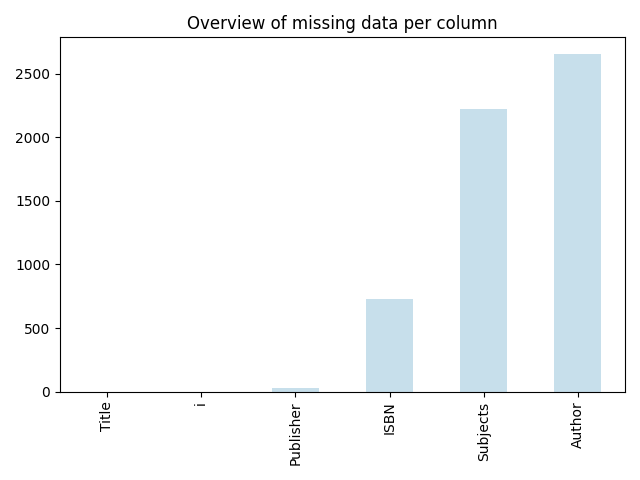

# Book Recommendation System: Final Report
A machine learning project by Amélie Madrona & Linne Verhoeven.

## Table of Contens
1. [Subheading 1](#subheading-1)
2. [Subheading 2](#subheading-2)
3. [Subheading 3](#sub-heading-3)

## Introduction

This project aims to develop a recommender system that proposes books to users based on either their previous behavior (interaction history) or the characteristics of the books themselves. We explored three main approaches:

1. **Collaborative Filtering**: Based on user-item interaction patterns.
2. **Content-Based Filtering**: Based on item attributes like title, genre, and description.
3. **Hybrid Recommender**: A combination of both approaches.

We evaluated different models using metrics like **Precision@K** and **Recall@10** to measure the effectiveness of recommendations. 

Before we explain these different techniques, let's have an overview of the datasets that we were provided with. In the second section, we explain data enhancing techniques used to enrich the data at our availability. Then, we introduce the different methods we tried for our recommender system. Finally, we show example results of our recommender system.

## 📊 Datasets Overview and EDA

| Metric              | Count   |
|---------------------|--------:|
| Total interactions  | 87,047  |
| Unique items        | 15,291  |
| Unique users        | 7,838   |

Let's look at the data we have for the interactions.


Another couple of key metrics:
* The average number of interactions between a user and books is 11
* The median number of interactions is 6

We see that the distribution of interactions are positively skewed, with users having up to 385 interactions with reading materials!

Let's now look at the data we have for the items. The first thing to do was to perform a bit of data cleaning by:
* Extracting the first valid ISBN from the 'ISBN Valid' column.
* Cleaning the titles as they had a trailing '/', which also supports our data enhancing.
* Cleaning the authors from birth and death years to ensure a consistent data formatting.

The next step was to look at is how complete our dataset is, or how much missing data it has. 



We see that the only datapoints that we consistently have throughout all the items is the index (i) and the title, and publishers for almost all of them. Otherwise, roughly 5% of the ISBNs, 15% Authors and 17% of Subjects are missing.

There are also many other data points that we don't have: language, book description, publication date and perhaps information about the book covers. 

How could we possibly remedy this and enhance the data we have access to?

## Data enhancing 

### Google Books API

The data enhancing for this step was composed of two parts. First, looking up books based on their first valid ISBN to extract the following missing entries:
* Book Description
* Publisher
* Subjects

As well as new data points:
* Google's Canonical Link, or the permanent link to the Google Books entry of the book. This will possibly useful for our UI later.
* Google's Image Link, or the permanent link to the book's cover. This will also possibly useful for our UI later.
* Language of the book, possibly useful for our embeddings later.
* Publication date of the book, possibly useful for our embeddings later.

Second, we also looked up books by their title to try to extract their ISBN as well as all the other datapoints mentioned above. In doing so, we enhance the potential entries we find using our second data enhancing method. 

### ISBN Database API

The same datapoints as above were extracted using the ISBN Database. We combined all these newly found datapoints in the following way: first priority for all the fields to the original dataframe, then Google API entries, then ISBN Database entries. An exception to that is for the Image Link, which turned out being fallacious for many entries. We therefore gave priority to the Image link provided by the ISBN Database. When running our models, we tried giving the opposite priority to the two enhanced database, which did not change results by much. However, we made the choice to keep the entries from the original dataset intact, considering that it is the ground truth.

### Outcome of data enhancing

The final results of our data enhancing techniques are shown in the figure here below. The light blue bar indicates the original dataset, the next two bars the results of the individual data enhancing techniques and the last bar indicating the resulting dataframe after the combination of both methods. We're able to achieve remarkable results across all dimensions, hitting almost 80% and above for all the data points. 


### Data enhancing extension

In addition to the previous enhancing methods, we used BERTopics to extract the topics for each document from our corpus. To do so, we used the title and the description of each book. First, the algorithm uses a pretrained BERT model to capture semantic meaning of the text down to its core. Then, we used the built-in UMAP dimensionality reduction function to cluster the topics into 25 topics. The results are as follow:


We see that the large majority of the topics are unidentified by the model. The most prominent topics seem to be feminism, psychology and academic research. We could have manually labelled the clusters to make them more human-friendly, but decided to keep them as such to not introduce bias. In fact, we used these topics for our recommender system by including the extracted keywords per topic in embeddings, as seen in the next section. The results were An interesting extension to our work would be to run cross validation to find the optimal number of topics for the embeddings.


<!-- * Which is the best model?
* Show examples of recommendations for some users. Do they align with the users' history of book rentals? Report some examples of “good” predictions, and some "bad" predictions. Do they make sense?
* Use data augmentation. There exist several APIs (eg Google Books or ISBNDB) that bring extra data using the ISBN of a book. Additionally, you may use the metadata available for the items (books).
Have a position on the leaderboard of this competition, with score better than 0.1452. -->

### 1. Collaborative Filtering (CF)

Collaborative filtering makes recommendations by analyzing past user behavior (e.g., which books were read) and identifying similarities between users or items.

#### 1.1 User-Based CF

- **Concept**: Recommend books liked by users who are similar to the target user.
- **Baseline similarity**: Cosine similarity  
  - Measures the angle between item vectors; suitable for sparse, implicit data.
- **K-Nearest Neighbors (KNN)**:
  - We tested different values for k (number of neighbors) and found optimal performance at **k = 70**
  - _[insert graph]_

**Conclusion**: Cosine similarity consistently outperformed other metrics for item-item collaborative filtering in our implicit feedback setting.

#### 1.2 Item-Based CF

- **Concept**: Recommend books similar to those a user already interacted with.
- **Baseline Similarity**: Cosine similarity  
  - Measures the angle between item vectors; suitable for sparse, implicit data.
- **K-Nearest Neighbors (KNN)**:
  - We tested different values for k (number of neighbors) and found optimal performance at **k = 70**
  - _[insert graph]_
- **Pearson Correlation**: Not used because it's more effective for **explicit ratings** (e.g., from 1–5). Pearson correlation adjusts for user bias.

**Conclusion**: Cosine similarity consistently outperformed other metrics for item-item collaborative filtering in our implicit feedback setting ([in line with academic literature](https://link.springer.com/chapter/10.1007/978-981-10-7398-4_37)).

---

### 2. Content-Based Filtering (CBF)

Content-based filtering recommends books that are similar in content to those the user liked previously. This method does not depend on what other users did.

To compare book content, we transformed textual metadata (title, author, description, etc.) into **embeddings**: numerical vector representations of the semantic meaning of a piece of text that allow us to compute similarity.

#### 2.2 Embedding Techniques Used

##### TF-IDF (Term Frequency-Inverse Document Frequency)

- **What**: A classic method in information retrieval. Breaks down text into individual tokens and measures word importance relative to all other books.
- **How**: Represents text as sparse vectors based on word frequency, adjusted by how unique each word is.
- **Use Case**: Good for surface-level textual similarities (e.g., shared keywords).
- **Example**:  
  Book: *Harry Potter and the Philosopher's Stone*, Author: *J.K. Rowling*, Publisher: *Bloomsbury*  
  TF-IDF counts the frequency of each word, downweights common ones like “publishing,” and generates a sparse vector.

##### BERT Embeddings

- **What**: Deep learning model (transformer architecture) that takes full phrases or sentences.
- **How**: Generates dense, contextualized embeddings that understand semantic meaning.
- **Use Case**: Captures deeper relationships in content (e.g., plot similarities).
- **Example**:  
  Input: “Harry Potter and the Philosopher's Stone J.K. Rowling Bloomsbury”  
  BERT understands context and recognizes title, author, and organization even without exact matches.

##### Google Gemini Embeddings

- **What**: The `gemini-embedding-001` model from Google, accessed via API.
- **How**: Uses pretrained transformer models like BERT, but more advanced.
- **Use Case**: Leading semantic embedding model ([MTEB Leaderboard](https://huggingface.co/spaces/mteb/leaderboard)). Easy integration and efficient.

### 3. Hybrid Recommender System

We combined both collaborative and content-based approaches using a **weighted sum** of different similarity matrices.

```python
hybrid_sim = a * tfidf_sim + b * item_cf_sim + c * google_sim + d * bert_sim
```

We did not perform full grid search or cross-validation due to computational limits, but used **simplified tuning** to demonstrate the concept.

We found the highest precision using BERT, Google, and item-CF. The result of the simplified grid search showed:

_**[Insert table: highlight best combo]**_

**Note**: Without cross-validation, results may overfit. However, the hybrid approach still showed the best overall performance in our simplified tests.

---

## Evaluation Table

|                           | **user-user CF** | **item-item CF** | **BERT (item-based)** | **TF-IDF (item-based)** | **Google API (item-based)** | **Hybrid (CF + Content + Popularity)** |
|---------------------------|------------------|-------------------|------------------------|---------------------------|-----------------------------|----------------------------------------|
| **Precision@10**          | _[your value]_   | _[your value]_    | _[your value]_         | _[your value]_            | _[your value]_              | _[your value]_                         |
| **Recall@10**             | _[your value]_   | _[your value]_    | _[your value]_         | _[your value]_            | _[your value]_              | _[your value]_                         |

## Example recommendations

Let's pick a user at random and see what the recommender system outputs. Here below is shown the recommendations for user 0 as we formatted it in our user interface.


If we compare that with 5 books chosen at random that the user had previously read, we see that the recommender makes some meaningful ones. For instance


<!-- * Which is the best model?
* Show examples of recommendations for some users. Do they align with the users' history of book rentals? Report some examples of “good” predictions, and some "bad" predictions. Do they make sense?
* Use data augmentation. There exist several APIs (eg Google Books or ISBNDB) that bring extra data using the ISBN of a book. Additionally, you may use the metadata available for the items (books).
Have a position on the leaderboard of this competition, with score better than 0.1452. -->